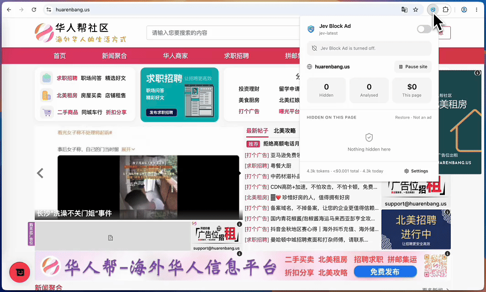

<p align="center">
  
</p>

<h1 align="center">Jev Block Ad</h1>

<p align="center">
  <strong>基于 TypeSafe AI Jev 模型的开源 AI 广告拦截器，适用于 Chrome 浏览器。</strong>无需过滤规则列表，Jev 逐一审查可疑元素并做出判断。<br />
  使用您自己的 <a href="https://typesafe.ai">TypeSafe AI</a> 密钥，其余全部在浏览器本地运行。
</p>

<p align="center">
  <a href="#安装">安装</a> ·
  <a href="#工作原理">工作原理</a> ·
  <a href="#与-ublock-origin--adblock-plus-的区别">vs uBlock Origin</a> ·
  <a href="#常见问题">常见问题</a> ·
  <a href="PRIVACY.md">隐私政策</a> ·
  <a href="README.md">English</a>
</p>

<p align="center">
  
</p>

Jev Block Ad 是一款免费、开源的 Chrome 扩展（Manifest V3），无需下载或维护任何过滤规则列表即可拦截广告。它不像 uBlock Origin 或 AdBlock Plus 那样对 URL 和 CSS 选择器进行规则匹配，而是将页面上每个疑似广告的元素用少量结构化字段进行描述，然后向 [Jev](https://docs.typesafe.ai)（TypeSafe AI 的"System One"决策模型）提出一个问题：*这是广告吗？* 您只需提供来自 TypeSafe 控制台的 API 密钥，无需账号、无需订阅、没有任何中间服务器。

该项目同时也是一个完整可运行的 Jev 使用示例：每个元素一道 Choice 题，批量打包成一个请求，所有阈值由代码控制。如果您正在评估 Jev 在分类、路由或内容审核场景的适用性，可重点阅读 [`src/shared/jev/questions.ts`](src/shared/jev/questions.ts) 中的请求构建逻辑和 [`src/background/decisions.ts`](src/background/decisions.ts) 中的决策逻辑。

---

## 为什么要做这个

传统广告拦截器需要维护数以兆计的手工过滤规则，在与广告商的"军备竞赛"中频频落后。Jev Block Ad 选择了另一条路：用少量结构化字段描述每个疑似广告元素，交给专为此类快速、精准判断而生的模型来决策。

[Jev](https://docs.typesafe.ai) 是 TypeSafe 的"System One"模型。您向它发送*状态*和带类型的*问题*，它返回校准过的概率值，而非生成式文本。它速度快（几十到几百毫秒）、成本低（每百万输入 token $0.042，输出免费），且不会在您给定的答案空间之外产生幻觉，非常适合在页面规模下回答"这个东西是广告吗？"。

## 基于 Jev 构建

Jev 不是聊天模型。您向它发送*状态*（此处为紧凑的元素描述列表）和带类型的*问题*（此处为每个元素一道 `choice` 题，包含六个选项），它在一次请求中返回每个选项的概率及置信度分数，典型延迟为 70 到 500 毫秒。没有提示词，没有生成文本，也无需解析。该扩展发送的完整请求如下所示：

```json
{
  "model": "jev-latest",
  "state": {
    "page": { "host": "example-news.com", "title": "Markets rally…" },
    "candidates": [
      { "i": 0, "tag": "iframe", "size": "300x250", "iframe_host": "safeframe.googlesyndication.com", "container": "aside", "signals": ["third_party_iframe", "iab_size"] },
      { "i": 1, "tag": "div", "classes": ["card", "card--promo"], "text": "Sponsored · Meet the SUV built for everything", "link_hosts": ["outbrain.com"], "rel_sponsored": true, "container": "main" }
    ]
  },
  "questions": {
    "c0": { "type": "choice", "instructions": "What is `candidates[0]` on this web page?", "criteria": { "display_ad": "…", "sponsored_native": "…", "consent_or_popup": "…", "first_party_promo": "…", "site_content": "…", "site_ui": "…" } },
    "c1": { "type": "choice", "instructions": "What is `candidates[1]` on this web page?", "criteria": { "…": "…" } }
  }
}
```

仓库中的其他代码都是围绕这个请求的"管道工程"：寻找候选元素、缓存答案、隐藏元素。

## 工作原理

```
页面 ──► 内容脚本
          发现候选元素     第三方 iframe、IAB 标准广告尺寸、广告技术属性、rel="sponsored"、
                          "Sponsored" 标签、id/class 关键词、固定悬浮层
          描述每个元素     标签、class、尺寸、位置、页面区域、链接/iframe 主机名、
                          最多 150 字符的可见文本
          ──► Service Worker
                覆盖规则  ►  保留
                缓存命中  ►  复用
                缓存未命中 ►  每批次一个 Jev 请求，每个候选元素一道 Choice 题：
                             display_ad · sponsored_native · consent_or_popup ·
                             first_party_promo · site_content · site_ui
          当聚合广告概率超过各分类阈值、明显高于安全分类且答案置信度足够时，隐藏元素
```

决策按主机和结构指纹缓存，重复访问通常不会发送任何请求。在连续多次命中后，扩展会生成 CSS 选择器，在页面渲染前即隐藏该元素。

请求的完整格式在 [`src/shared/jev/questions.ts`](src/shared/jev/questions.ts) 中定义。所有阈值由代码控制，模型只负责判断。

## 安装

目前尚无商店上架，请以未打包扩展形式加载：

```bash
git clone https://github.com/fazlerocks/jev-adblock
cd jev-adblock
npm install
npm run build
```

1. 打开 `chrome://extensions`，开启**开发者模式**，点击**加载已解压的扩展程序**，选择 `dist/` 文件夹。
2. 设置页面随即打开。前往 [console.typesafe.ai/keys](https://console.typesafe.ai/keys) 创建密钥，粘贴后点击**保存并测试**。
3. 阅读隐私声明并开启确认开关，**状态**卡片变绿即表示一切就绪。

<p align="center">
  
</p>

## 哪些数据会离开您的浏览器

对于每个疑似广告的元素，扩展会向 TypeSafe 发送：

- 页面主机名、标题和语言
- 元素的标签、class 名称、ARIA 角色和标签、尺寸、位置及页面区域
- 其中链接和 iframe 的主机名（绝不包含完整 URL）以及触发它的启发式规则
- 最多 150 字符的可见文本

**绝不发送**：表单值、Cookie、完整 URL 或候选元素以外的页面文本。包含密码字段或支付 iframe 的页面不会被分析。您的 API 密钥存储在扩展的本地存储中，仅发送至 `api.typesafe.ai`，无任何遥测数据。详见 [PRIVACY.md](PRIVACY.md)。

## 功能特性

- **自带密钥。** 保存密钥并接受隐私声明之前，不会分析任何内容。
- **六种分类，各有独立阈值。** 可识别同意弹窗和站点自有推广内容，但默认不隐藏，除非您主动开启。
- **缓存与站点规则。** 决策缓存七天；连续多次命中后转化为渲染前 CSS 规则，过期后自动失效并重新校正。
- **纠错。** "不是广告"可恢复元素并将其永久固定为"永不隐藏"。
- **预算与安全限制。** 每日 token 预算上限、API 失败熔断机制、支付/认证/验证码/嵌入式 iframe 的硬性白名单。
- **消散特效。** 可选功能：广告变为灰烬，从某个角落碎裂并随页面范围的风吹散，随后空间平滑关闭。支持跨站广告 iframe，并遵循 `prefers-reduced-motion` 设置。
- **每页费用。** 弹窗显示当前页面及历史累计的 token 用量和美元花费。

## 费用

首次访问一个广告密集的新闻页面约发送一个 10k 输入 token 的请求，费用约 $0.0004。缓存命中时免费。每天浏览 250 个新页面，一个月约 13 美分。默认每日预算上限为 500 万 token（约 $0.21），强制执行。

## 开发

```bash
npm run dev         # 变更时自动重建；从 chrome://extensions 重新加载扩展
npm run typecheck   # tsc 类型检查
npm test            # vitest 单元测试
npm run e2e         # Playwright：在 Chromium 中加载 dist/，并模拟 api.typesafe.ai
```

实用脚本：

| 脚本 | 作用 |
|---|---|
| `node scripts/debug-fixture.mjs` | 打印发送给 Jev 的 fixture 页面的完整候选描述符 |
| `node scripts/screenshot-ui.mjs <dir>` | 在真实扩展上下文中渲染弹窗和设置页面截图 |
| `node scripts/snap-frames.mjs <dir>` | 录制消散特效并生成联系表 |

### 目录结构

```
static/            manifest.json、弹窗和设置页面 HTML/CSS、content.css、图标
src/shared/        类型、常量、消息契约、清理器、指纹、Jev 客户端、问题构建器、图标
src/content/       候选元素发现、描述符、隐藏器、消散特效、观察器、站点规则注入
src/background/    路由器、分类流水线、决策、缓存、站点规则、用量、标签页状态、徽章
src/popup/  src/options/
test/unit/  test/e2e/  test/fixtures/  test/mock/
```

无运行时依赖。图标为内联的 [Lucide](https://lucide.dev) SVG。

### 设计说明

- **Jev 无法读取 HTML。** `src/content/describe.ts` 中的描述符是影响准确率的关键。如需提升召回率，从那里入手。
- **聚合而非 argmax。** `decisions.ts` 在与阈值比较前会将各广告分类概率求和，因此展示广告和原生赞助内容各占 45/40 时仍会隐藏。
- **失败时开放。** 任何错误、超时或预算耗尽都只会导致不隐藏任何内容，页面始终正常工作。
- **密钥永远不会到达内容脚本。** 如有任何 `src/content/` 下的文件引用密钥，单元测试会失败。

## 已知限制

- 首次访问页面时，广告在扫描加上 Jev 延迟的时间内仍会显示。缓存命中时在第一次空闲扫描即可隐藏；站点规则可在渲染前隐藏（除非开启了消散特效，特意让广告先出现再消散）。
- 网站自有播放器内的视频流广告无法通过隐藏元素来移除，需要网络层拦截，这是本项目有意不做的事。
- 跨域 iframe 从父页面进行判断；嵌套在其中的广告要么整体隐藏，要么不处理。
- 在**开放**的 shadow root（MGID、Taboola、Outbrain）中渲染的原生组件，会在宿主元素处被扫描和隐藏。封闭的 shadow root 任何扩展都无法访问。
- 需要 `<all_urls>` 主机权限以在所有网站上运行。

## 与 uBlock Origin / AdBlock Plus 的区别

| | Jev Block Ad | uBlock Origin / AdBlock Plus |
|---|---|---|
| 广告识别方式 | 模型根据简短结构描述对每个可疑元素进行判断 | 社区维护的过滤规则列表（EasyList 等）与 URL 和 CSS 选择器匹配 |
| 拦截网络请求和追踪器 | 否，仅隐藏元素 | 是 |
| 处理新型或非常规广告布局 | 是，只要元素看起来像广告就会被判断 | 需要有人为其编写规则后才能拦截 |
| 拦截视频流广告（YouTube、网站播放器） | 否 | 部分支持，取决于规则列表和平台 |
| 支持 Chrome Manifest V3 | 是，无 `declarativeNetRequest` 规则数量限制，因为没有规则列表 | uBlock Origin Lite 和 ABP 在 MV3 规则上限内运行 |
| 费用 | 使用您自己的 TypeSafe API 密钥；每个新页面不到一分钱，之后缓存 | 免费 |
| 数据离开浏览器 | 将紧凑的元素描述发送至 `api.typesafe.ai`，字段详见 [PRIVACY.md](PRIVACY.md) | 仅下载过滤规则列表 |
| 上手方式 | 粘贴密钥，接受隐私声明 | 安装即用 |

如果您希望零配置、最大化拦截范围，请使用 uBlock Origin。Jev Block Ad 适合那些想了解无规则列表、模型驱动的拦截器是什么样子、并且可以接受按页付费模式的用户。

## 常见问题

**Jev Block Ad 安全吗？**
代码量小，一个下午就能读完，没有运行时依赖，也没有遥测数据。您的 API 密钥存储在扩展本地存储中，仅发送至 TypeSafe。包含可见密码字段或支付表单的页面不会被分析，任何您可以输入的内容都不会被描述。完整数据字段见 [PRIVACY.md](PRIVACY.md)。

**AI 广告拦截器如何工作？**
廉价的启发式规则先筛出可能是广告的元素：第三方 iframe、标准广告尺寸、广告技术属性、`rel="sponsored"` 链接、"Sponsored"标签、固定悬浮层。每个元素用约二十个词描述（标签、class、尺寸、位置、页面区域、链接主机名、文本片段）。这些描述批量发送给 Jev，Jev 为六个分类各返回一个概率。代码应用阈值，隐藏符合条件的元素。决策按站点缓存一周。

**能拦截 YouTube 广告吗？**
不能。视频流内的广告是视频的一部分，移除它们需要网络层拦截，这是本扩展有意不做的事。播放器周围的展示广告和赞助卡片与其他网站一样处理。

**是免费的吗？**
扩展本身免费，MIT 许可证。向 TypeSafe 发送的请求按您自己的密钥计费，每百万输入 token $0.042。首次访问广告密集页面约花费 $0.0004；重复访问从缓存获取，不产生费用。每日预算上限默认开启。

**支持 Chrome Manifest V3 吗？**
是的。它作为 Manifest V3 扩展构建，不使用 `declarativeNetRequest`，因此不受限于列表型拦截器的 MV3 规则上限。暂不支持 Firefox 和 Safari。

**可以纠正错误判断吗？**
可以。弹窗列出当前页面上所有被隐藏的内容。"恢复"可暂时恢复元素；"不是广告"可恢复元素并将该判断永久固定在该站点。设置中的阈值和分类开关立即生效，包括对已缓存的决策。

**Jev 是什么？**
[Jev](https://docs.typesafe.ai) 是 TypeSafe AI 的"System One"模型。它不生成文本，而是接受结构化状态和带类型的问题，在几十到几百毫秒内返回校准过的概率值。这使其非常适合"这个元素是广告吗？"这类高频、精准的判断任务。

## 贡献

欢迎提交 Issue 和 Pull Request。详见 [CONTRIBUTING.md](CONTRIBUTING.md)。目前最有价值的贡献是附带描述符的真实误报和漏报案例，可通过 `scripts/debug-fixture.mjs` 和 Service Worker 的 Network 面板获取。

## 许可证

[MIT](LICENSE)
